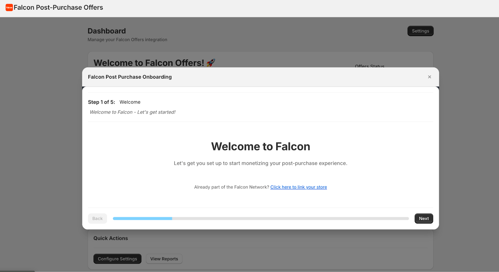
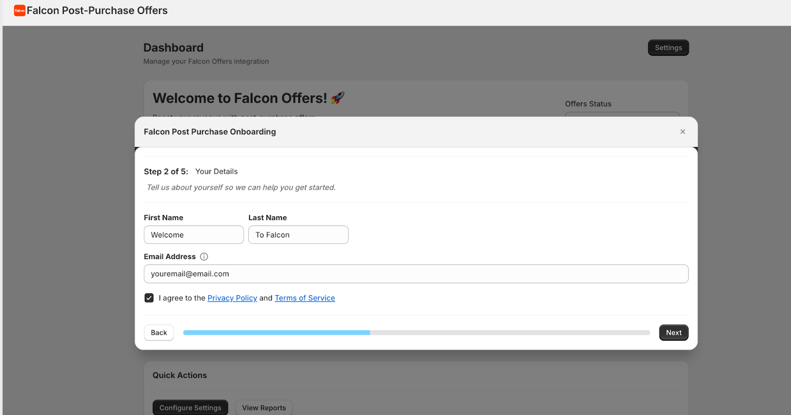
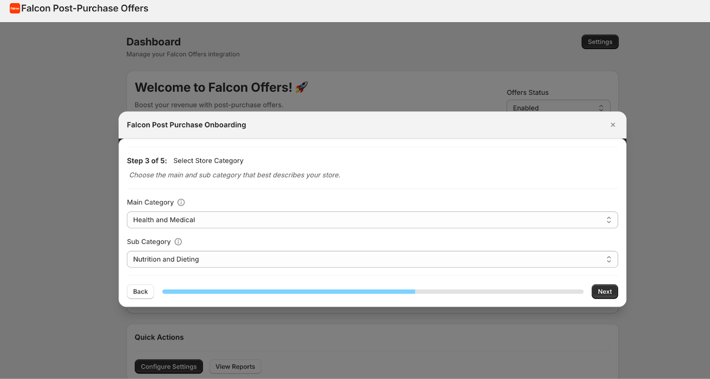
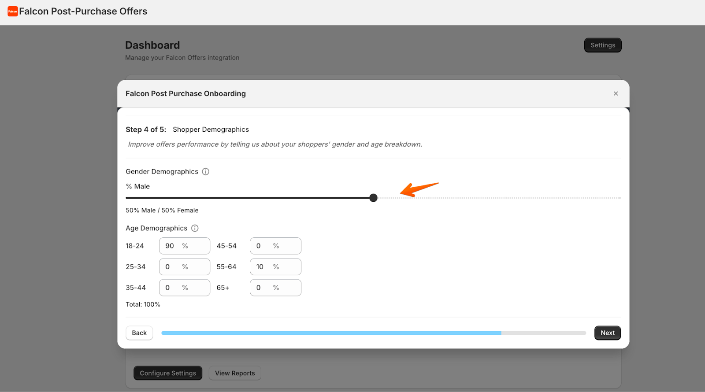
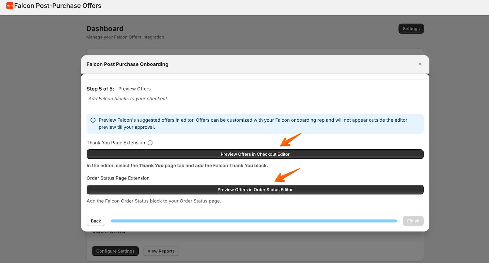
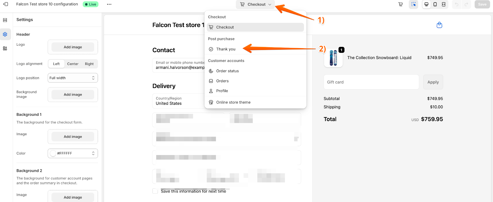
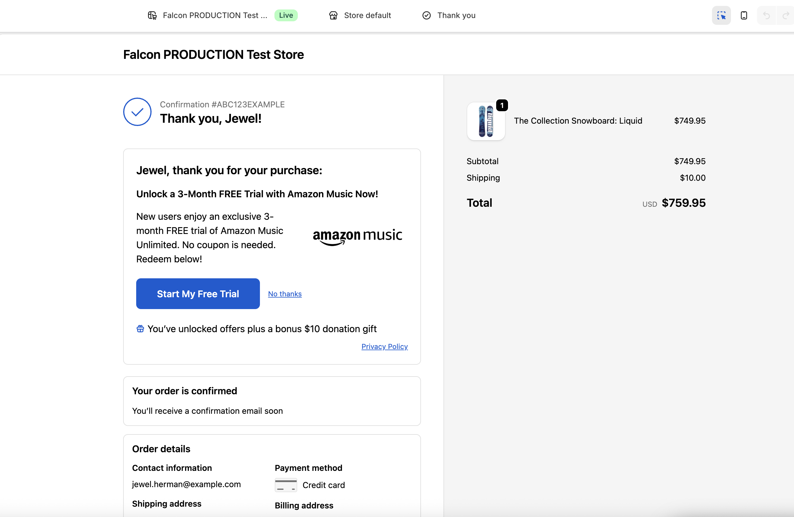
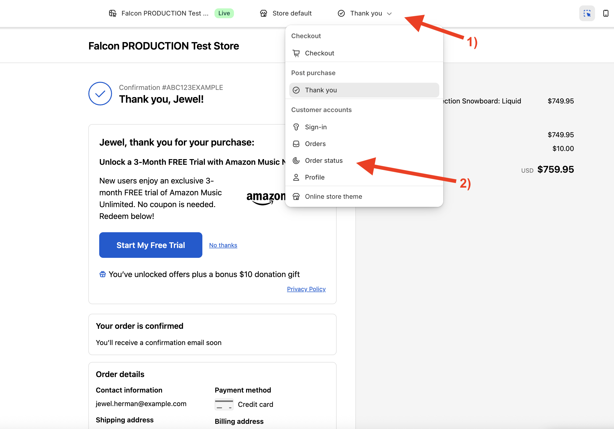

# How to get started with Falcon on Shopify?

Getting started with Falcon is super easy, and should take less than 10 minutes 🚀

Falcon powers the Post Purchase Offers of over **4,500 brands** in the Shopify ecosystem alone!!

Before, Falcon was only available through a private app link, but we just made it public, so everyone can start using Falcon 🎉

This article will guide you through the set up process, so you can start monetizing your Thank You and Order Status pages.

### 1. Install our App

You can find our public Shopify App listing here: https://apps.shopify.com/falcon-cross-sell.

### 2. Onboarding Flow

**Step 1**: After installing our app, you will see Falcon’s onboarding flow. You can click **_next_** to begin with the process.

**Step 2**: Add your contact information and accept Falcon’s [Privacy Policy](https://falconlabs.us/privacy) and [Terms of Service](https://www.falconlabs.us/publisher-agreement). This will allow us to create your account in our system.

**Step 3**: Now select your store’s Main Category, and then your Sub Category using the dropdown menu. These categories allow us to narrow down personalization and testing, so we can begin optimizing offers for your store right away.

**Step 4**: Provide information about your Shopper Demographics. This can be an estimate of what type of shoppers are your ideal target and actual customers.

Use the bar to increase or decrease the Gender Demographics split, by default it is 50/50 split between female and male, but if most of your shoppers are female, you can shift the bar to the left to decrease the male % and increase the female %.

If you don’t know the exact information, don’t worry, as you can change this later on, and estimates work just fine.

**Step 5**: Congrats! You’re almost done 🎉

The last step is to preview and add the Falcon blocks inside your Thank You page and your Order Status Page.

To clarify, the Thank You page is the one that your customers see once their order is confirmed. The Order Status page is the one that shows customers the status of their order, and the link is sent to them inside the order confirmation email they receive from Shopify.

The “Preview Offers” link highlighted above, a new tab will open and we will take you to your Checkout and Customer Account editor inside Shopify.

To see a preview of the offers, navigate to the Thank You page as follows:

Once you click on the Thank You page, you should see a preview of a sample offer.

You can repeat the same process to see the Order Status page preview:

### 3. The final step, let’s go live
